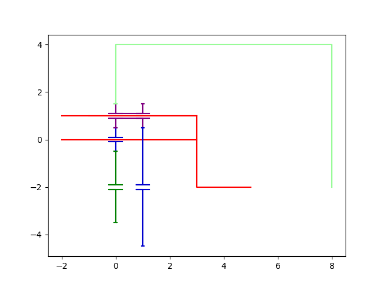
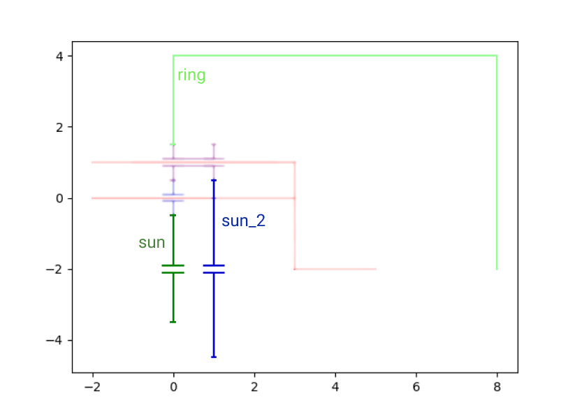
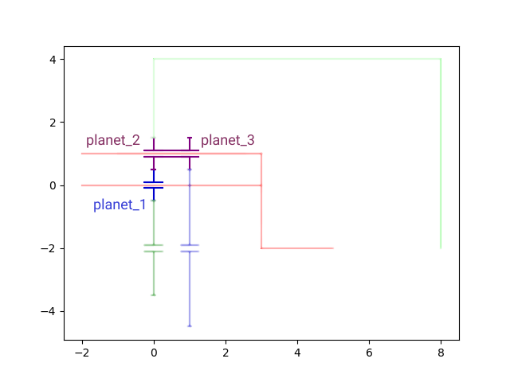
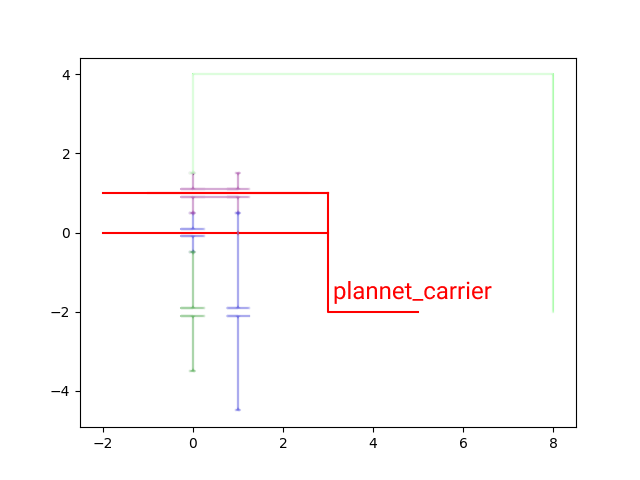
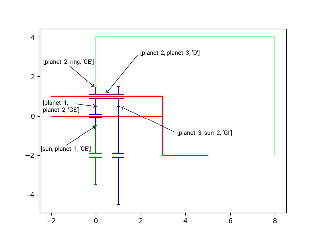

Define a Planetary Gear
============

In this tutorial, we will define a Planetary Gear 

The complete script can be found in scripts/meshes/planetary_gears_instanciation.py

What do we call a planetary gear?
^^^^^^^^^^^^^^^^^^^^^^^^^^^^^^

A Planetary gear is a mechanical system composed by planets(minimum 1), planetaries (minimum 2) and 1 planet_carrer.

Python imports
^^^^^^^^^^^^^^

First, we import mechanical_components.planetary_gears package 

.. literalinclude:: ../../scripts/planetary_gears/planetary_gears_instantiation.py
  :lines: 8

In most scripts, the package is imported as pg to make it shorter.

Define a Planetary
^^^^^^^^^^^^^^^^^^^^^^^^^^^^^^

.. seealso::

  .. autoclass:: mechanical_components.planetary_gears.Planetary

Exemple of input data for a planetary

.. literalinclude:: ../../scripts/planetary_gears/planetary_gears_instantiation.py
  :lines: 10-12

Define a Planet
^^^^^^^^^^^^^^^^^^^^^^^^^^^^^^

.. seealso::

  .. autoclass:: mechanical_components.planetary_gears.Planet

Exemple of input data for a planet

.. literalinclude:: ../../scripts/planetary_gears/planetary_gears_instantiation.py
  :lines: 14-16

Define a Planet Carrier
^^^^^^^^^^^^^^^^^^^^^^^^^^^^^^

.. seealso::

  .. autoclass:: mechanical_components.planetary_gears.PlanetCarrier

Exemple of input data for a planet carrier

.. literalinclude:: ../../scripts/planetary_gears/planetary_gears_instantiation.py
  :lines: 13

Define a Connection
^^^^^^^^^^^^^^^^^^^^^^^^^^^^^^

.. seealso::

  .. autoclass:: mechanical_components.planetary_gears.Connection

Exemple of input data for a connection

.. literalinclude:: ../../scripts/planetary_gears/planetary_gears_instantiation.py
  :lines: 17-21

Define a Planetary Gears
^^^^^^^^^^^^^^^^^^^^^^^^^^^^

.. seealso::

  .. autoclass:: mechanical_components.planetary_gears.PlanetaryGear

Exemple of input data for a planetary_gears

.. literalinclude:: ../../scripts/planetary_gears/planetary_gears_instantiation.py
  :lines: 10-24

