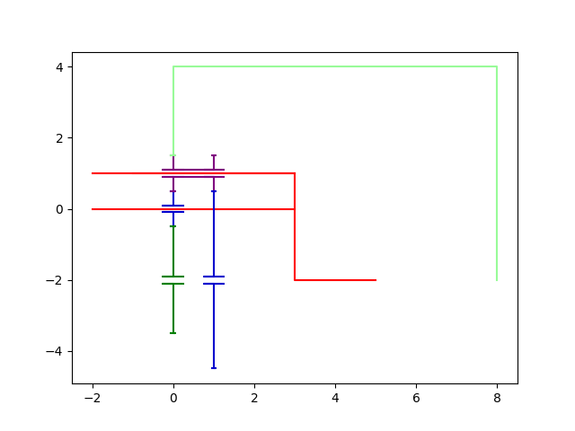

Define a Planetary Gear
----------------------------------

In this tutorial, we will define a Planetary Gear

The complete script can be found in scripts/meshes/planetary_gears_instanciation.py

Python imports
^^^^^^^^^^^^^^

First, we import mechanical_components.planetary_gears package 

.. literalinclude:: ../../scripts/planetary_gears/planetary_gears_instantiation.py
  :lines: 8

In most scripts, the package is imported as pg to make it shorter.

Definition of the input data
^^^^^^^^^^^^^^^^^^^^^^^^^^^^

A description of the input data is beside:

.. literalinclude:: ../../mechanical_components/planetary_gears.py
  :lines: 300-316

The definition of the input data for planetary_gears is described in the following code

.. literalinclude:: ../../scripts/planetary_gears/planetary_gears_instantiation.py
  :lines: 10-20

