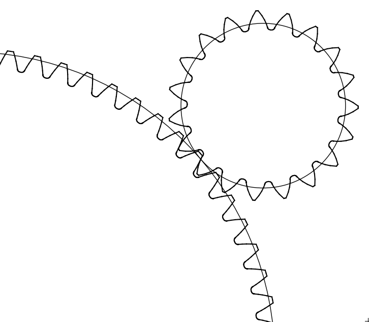

Define and Optimize a simple gear mesh
--------------------------------------

In this tutorial, we will define and optimize a simple gear mesh

The complete script can be found in scripts/meshes/meshes0.py

Python imports
^^^^^^^^^^^^^^

First, we import mechanical_components.optimization.meshes package and then one subpackage:
 * numpy (http://www.numpy.org)

.. literalinclude:: ../../scripts/meshes/meshes0.py
   :lines: 3-4

In most scripts, the package is imported as meshes to make it shorter.

Input definition
^^^^^^^^^^^^^^^^

The minimum parameters to define one gear mesh are:
 * List define minimum and maximum center-distance
 * List of connected gear mesh
 * Dictionary of admissible speed for each component

.. literalinclude:: ../../scripts/meshes/meshes0.py
   :lines: 6-10

MeshAssemblyOptimizer definition
^^^^^^^^^^^^^^^^^^^^^^^^^^^^^^^^

The objet MeshAssemblyOptimizer is then generated, and a decision tree is used to define all teeth number available

.. literalinclude:: ../../scripts/meshes/meshes0.py
   :lines: 12-14

.. seealso::

  .. autoclass:: mechanical_components.optimization.meshes.MeshAssemblyOptimizer
     :noindex:

Gear mesh optimization
^^^^^^^^^^^^^^^^^^^^^^

The objet MeshAssemblyOptimizer propose two different methods to optimize the  gear mesh
  * An automatic optimization approach where the optimization is perform only for the best candidate toward center-distance and modulus
  * A classical (sequential method) optimization approach where we optimize all the design of experiment

Automatic gear mesh optimize
****************************

.. literalinclude:: ../../scripts/meshes/meshes0.py
   :lines: 16-19

Sequential gear mesh optimize
*****************************

.. literalinclude:: ../../scripts/meshes/meshes0.py
   :lines: 21-22

Export CAD and SVG
^^^^^^^^^^^^^^^^^^

The objet MeshAssemblyOptimizer propose some method to generate a SVG graph and a 3D CAD in FreeCAD

.. literalinclude:: ../../scripts/meshes/meshes0.py
   :lines: 24-28
