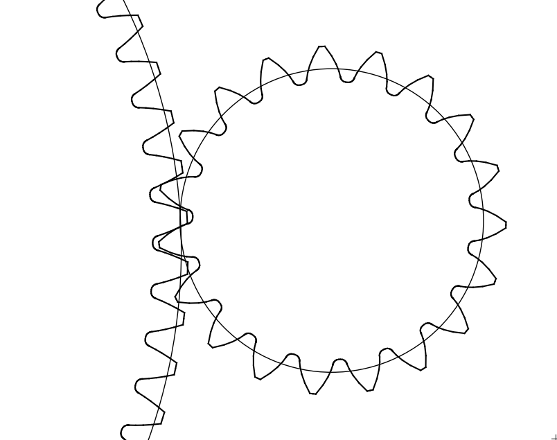
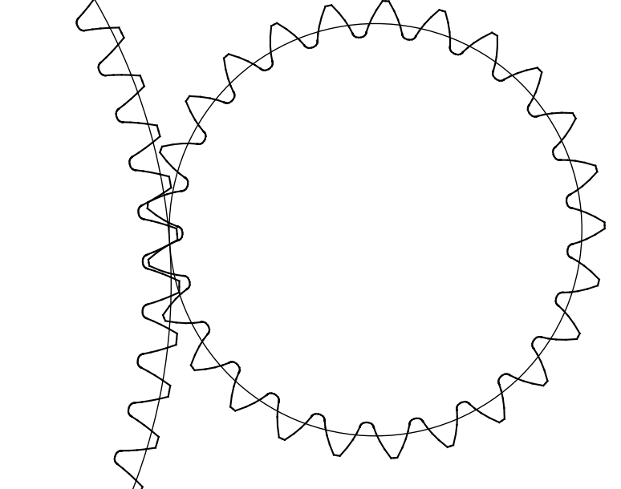

Define and Optimize a non ISO gear mesh
---------------------------------------

In this tutorial, we will define and optimize a non ISO simple gear mesh

The complete script can be found in scripts/meshes/meshes1.py

Python imports
^^^^^^^^^^^^^^

First, we import mechanical_components.optimization.meshes package and then one subpackage:
* numpy (http://www.numpy.org)

.. literalinclude:: ../../scripts/meshes/meshes1.py
  :lines: 3-5

In most scripts, the package is imported as meshes to make it shorter.

Simple rack modification
^^^^^^^^^^^^^^^^^^^^^^^^

The following example propose in this first case to optimize the modulus between 1 and 2.5 (in the input data, the modulus should be in meter). The input data are described below with the complete rack definition

.. literalinclude:: ../../scripts/meshes/meshes1.py
  :lines: 6-20

The objet MeshAssemblyOptimizer is generated with the previous parameters

.. literalinclude:: ../../scripts/meshes/meshes1.py
  :lines: 22-31

An the automatic optimization method is used to perform the calculation

.. literalinclude:: ../../scripts/meshes/meshes1.py
  :lines: 33-35

Export method are described below

.. literalinclude:: ../../scripts/meshes/meshes1.py
  :lines: 36-37

Complex rack modification
^^^^^^^^^^^^^^^^^^^^^^^^^

The following case propose to optimize all the parameters of one rack and to use the same rack to define the two gear mesh

We propose to modify the following parameters
  * modulus
  * gear addendum coefficient
  * gear dedendum coefficient

.. literalinclude:: ../../scripts/meshes/meshes1.py
  :lines: 48-71

We obtain with the SVG export the folowing gear mesh

Complex and several rack
^^^^^^^^^^^^^^^^^^^^^^^^

The following case propose to use the following rack:
  * a variable rack (non ISO)
  * a ISO rack with a modulus of 1.8
  * a ISO rack with a modulus of 1.9
  * a ISO rack with a modulus of 2

And to analyse witch is the best combination of rack to design several gear mesh. In this case the decision tree is used to
  * define the teeth number
  * define the rack definition in the previous list

.. literalinclude:: ../../scripts/meshes/meshes1.py
  :lines: 75-109
