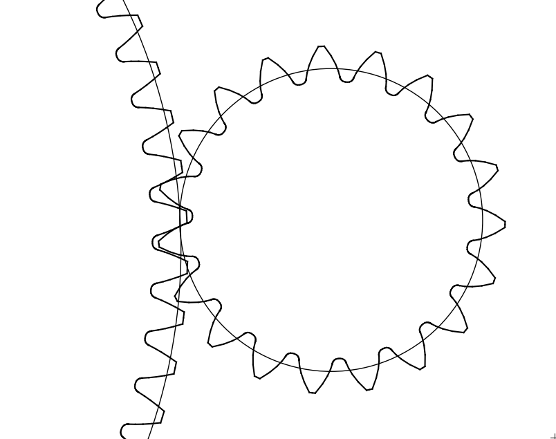

Define and Optimize a non ISO gear mesh
---------------------------------------

In this tutorial, we will define and optimize a non ISO gear mesh

The complete script can be found in scripts/meshes/meshes1.py

Python imports
^^^^^^^^^^^^^^

First, we import mechanical_components.optimization.meshes package and then one subpackage:
* numpy (http://www.numpy.org)

.. literalinclude:: ../../scripts/meshes/meshes1.py
  :lines: 3-5

In most scripts, the package is imported as meshes to make it shorter.

Input definition
^^^^^^^^^^^^^^^^

The minimum parameters to define one gear mesh are:
  * List define minimum and maximum center-distance
  * List of connected mesh
  * Dictionary of admissible speed

.. literalinclude:: ../../scripts/meshes/meshes1.py
  :lines: 6-19

MeshAssemblyOptimizer definition
^^^^^^^^^^^^^^^^^^^^^^^^^^^^^^^^

.. literalinclude:: ../../scripts/meshes/meshes1.py
  :lines: 21-30

Gear mesh optimization
^^^^^^^^^^^^^^^^^^^^^^

.. literalinclude:: ../../scripts/meshes/meshes1.py
  :lines: 32-34

Export CAD and SVG
^^^^^^^^^^^^^^^^^^

.. literalinclude:: ../../scripts/meshes/meshes1.py
  :lines: 35-37
