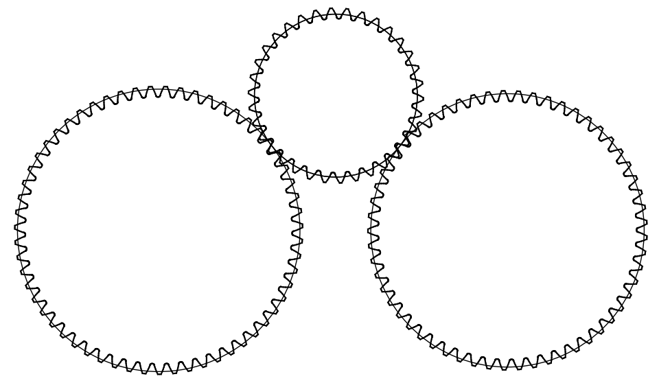

Define and Optimize 3 gears meshes
----------------------------------

In this tutorial, we will define and optimize 3 gears meshes with an ISO rack

The complete script can be found in scripts/meshes/meshes2.py

Python imports
^^^^^^^^^^^^^^

First, we import mechanical_components.optimization.meshes package and then one subpackage:
* numpy (http://www.numpy.org)

.. literalinclude:: ../../scripts/meshes/meshes2.py
  :lines: 3-5

In most scripts, the package is imported as meshes to make it shorter.

Definition of the input data
^^^^^^^^^^^^^^^^^^^^^^^^^^^^

The definition of the input data for several gears meshes is described in the following code

.. literalinclude:: ../../scripts/meshes/meshes2.py
  :lines: 6-19
