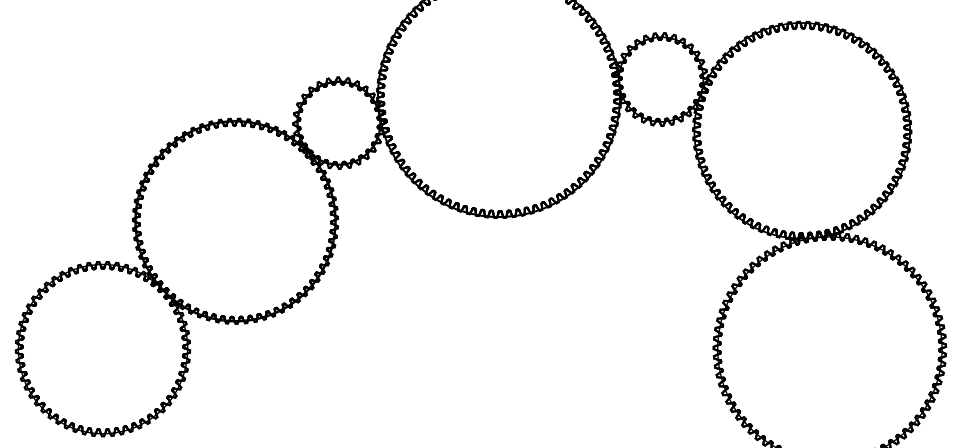
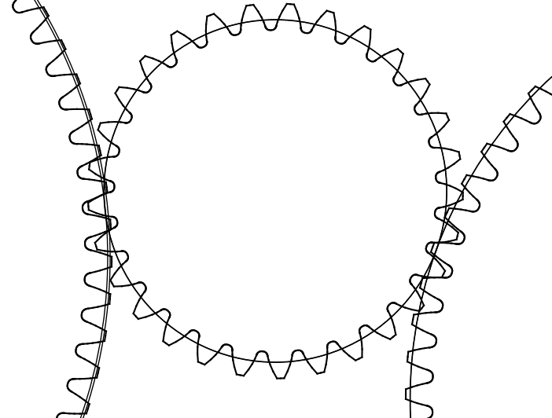

Define and Optimize 7 gears meshes
----------------------------------

In this tutorial, we will define and optimize 7 gears meshes with an ISO rack

The complete script can be found in scripts/meshes/meshes3.py

Python imports
^^^^^^^^^^^^^^

First, we import mechanical_components.optimization.meshes package and then one subpackage:
* numpy (http://www.numpy.org)

.. literalinclude:: ../../scripts/meshes/meshes3.py
  :lines: 3-5

In most scripts, the package is imported as meshes to make it shorter.

Definition of the input data
^^^^^^^^^^^^^^^^^^^^^^^^^^^^

The definition of the input data for seven gears meshes is described in the following code

.. literalinclude:: ../../scripts/meshes/meshes3.py
  :lines: 6-27

Optimization and Export SVG graph
^^^^^^^^^^^^^^^^^^^^^^^^^^^^^^^^^

When the optimization is perform for many gears meshes, it could be difficult to export an SVG graph without gear mesh recovery. We propose a method to trace all gears by defining the position of the first and the last gear

.. literalinclude:: ../../scripts/meshes/meshes3.py
  :lines: 29-42

