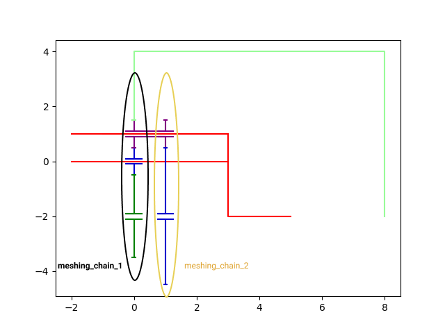
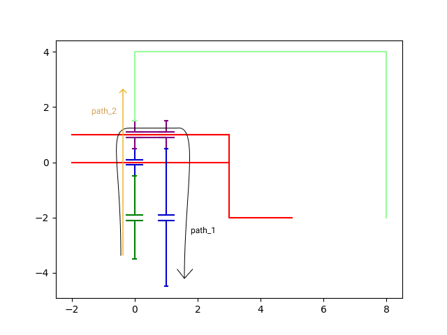
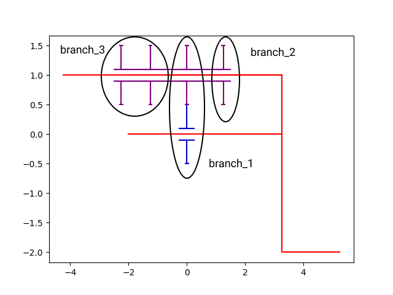
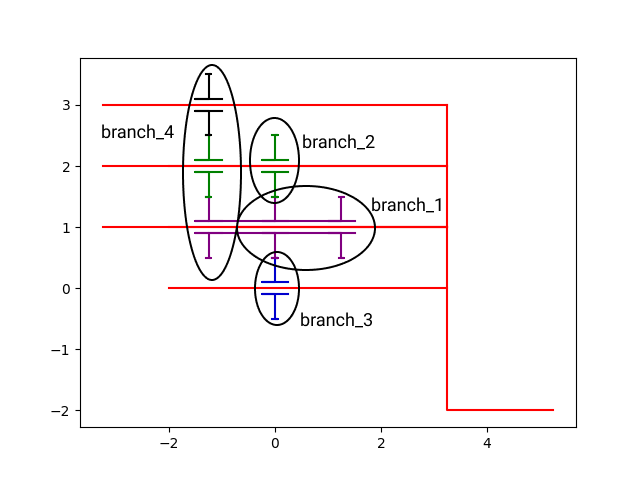
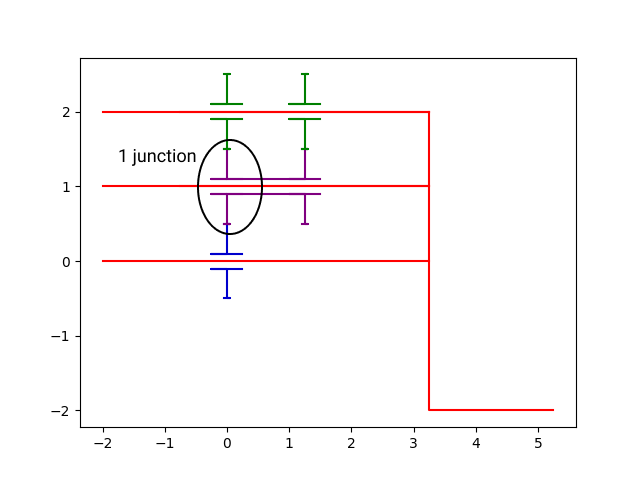
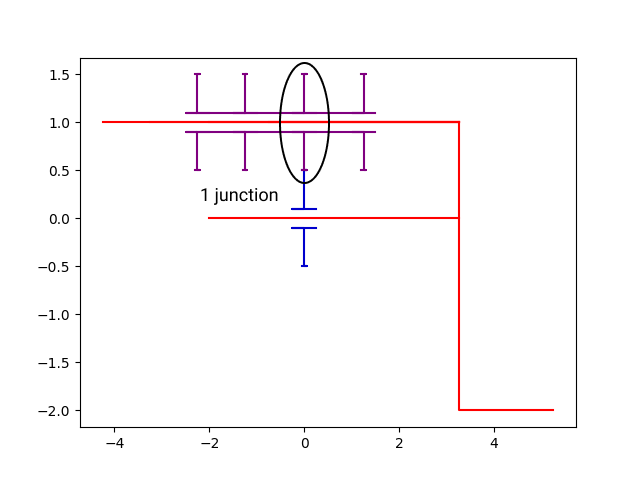
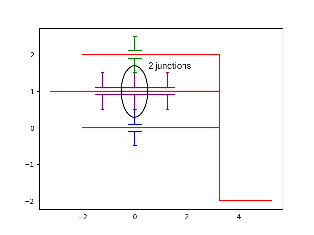

Vocabulary Planetary Gear 
=========================

In this part, we explain some concepts we use in the code for generate or analyse planetary gears. 

.. _meshing_chain:  

Meshing Chain 
----------------
A meshing chain is a list of planetaries and/or planets linked by mesh.

meshing_chain_1=[sun, planet_1, planet_2, ring]

meshing_chain_2=[sun_2, planet_3]

In a planetary gears ,there is minimum 1 planetary in a meching chain and maximum 2. The planetaries can be only at the beginning or/and at the end of the list. 
If there is a ring in one side at the list, the  planetary at the other side  is necessarily a sun ( if there is an another one)

It's use for the analyse to easily determinate the gearing plan. For the generator part, it's use to determinate the position and the form of the planetaries generated. 

.. seealso::

  .. autoclass:: mechanical_components.planetary_gears.PlanetaryGear
     :members: meshing_chain
  
.. _path:

Path 
----------------

A path represent the elements and the relations which there are betwen 2 elements (in a planetary gears, is betwen 2 planetaries).

The 2 elements are include in the list at the beginning and at the end .

In path, we can have : Planetary, Planet, Gearing, Double

path_1= [sun, gearing_1, planet_1, gearing_2, planet_2, double, planet_3, gearing_3, sun_2]

path_2= [sun, gearing_1, planet_1, gearing_2, planet_2, gearing_4, ring]

The path is use in planetary gears to calculate the reason and test the assembly condition between two planetaries. It's also use for the kinematic schema plot 

.. seealso::

  .. autoclass:: mechanical_components.planetary_gears.PlanetaryGear
     :members: path_planetary_to_planetary

.. _branch:

Branch 
----------------

A branch is a notion which concern only the planets structure in a planetary gear. It's a list wich contains only planets.

In a planet struture, when a planet is linked to 3 others planets, that correspond to a node where 3 branchs are connected. When a planet is linked to 4 others planets, that correspond to a node where 4 branch is connected.
  
In a branch, the only elements that can be linked with others planets are at the ending and at the beginning of the list.

number of branch= number of link with other planets

The notion of branch is also connected to the notion of junction. There is a node when there is a junction.

number of junction of a planet = number of branch connected to this planet -2  

The branch is use to generate the planets structures of planetary gear.

.. seealso::

  .. autoclass:: mechanical_components.planetary_gears_generator.GeneratorPlanetsStructure

.. _junction:

Junction
----------------

A junction is a notion which concern only the planets structure in a planetary gear. One junction correspond at a planet linked to 3 others planets. We consider that a plannet linked to 4 others planets coeespond at 2 junctions. Linked to 5 other plannets = 3 junction and etc...

number of junction of a planet = number of link with other planets - 2

The notion of junction is also connected to the notion of branch. There are a junction when a branch ending and 2 others begin (it's 2 junction when 3 others begin)

number of junction of a planet = number of branch connected to this planet -2  

The junction is use to generate the planets structures of  planetary gear.

.. seealso::

  .. autoclass:: mechanical_components.planetary_gears_generator.GeneratorPlanetsStructure

